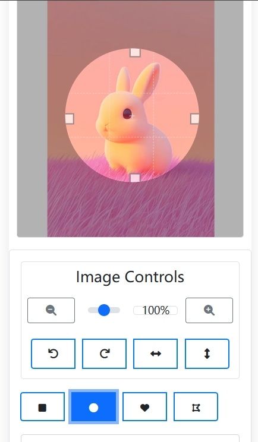

# Image Shape Clipper - 图片形状裁剪工具

  

## 📝 简介

Image Shape Clipper 是一个功能强大的 Chrome 浏览器扩展程序，让您能够轻松地将网页上的图片裁剪成各种形状。无论是圆形头像、心形装饰还是多边形剪裁，都可以快速完成。

## ✨ 主要功能

- 🔷 多种裁剪形状
    - 圆形
    - 方形
    - 多边形
    - 心形
    - 更多...
- 🔄 图片编辑功能
    - 水平/垂直翻转
    - 旋转调整
    - 缩放控制
- 💾 多格式导出
    - PNG (支持透明背景)
    - JPG
    - WebP
- 🎯 简单易用的操作界面
- 🚀 快速处理，实时预览

## 🔧 安装方法

1. 访问 [Chrome 网上应用店](https://chrome.google.com/webstore)
2. 搜索 "Image Shape Clipper"
3. 点击 "添加至 Chrome"

或者

1. 下载本仓库的代码
2. 打开 Chrome 浏览器，进入扩展程序页面 (chrome://extensions/)
3. 开启开发者模式
4. 点击 "加载已解压的扩展程序"，选择下载的代码文件夹

## 📖 使用说明

1. 在任意网页上右键点击图片
2. 在弹出菜单中选择 "Image Shape Clipper"
3. 在编辑界面中选择所需的裁剪形状
4. 调整位置和大小
5. 选择导出格式并保存

## 🖼️ 效果展示

  

## 🤝 贡献指南

欢迎提交 Issue 和 Pull Request！

1. Fork 本仓库
2. 创建您的特性分支 (`git checkout -b feature/AmazingFeature`)
3. 提交您的更改 (`git commit -m 'Add some AmazingFeature'`)
4. 推送到分支 (`git push origin feature/AmazingFeature`)
5. 打开一个 Pull Request

## 📄 开源协议

本项目基于 MIT 协议开源 - 查看 [LICENSE](LICENSE) 文件了解更多详情

## 📮 联系方式

如果您有任何问题或建议，欢迎通过以下方式联系我们：

- 提交 [Issue](https://github.com/yourusername/image-shape-clipper/issues)
- 发送邮件至：[your-email@example.com](mailto:your-email@example.com)

## 🌟 支持项目

如果您觉得这个项目对您有帮助，欢迎给我们一个 Star ⭐️！
